---
## Front matter
title: "Отчёт по лабораторной работе № 2"
subtitle: "Дисциплина: Архитектура компьютера"
author: "Зинченко Анастасия Романовна"

## Generic otions
lang: ru-RU
toc-title: "Содержание"

## Bibliography
bibliography: bib/cite.bib
csl: pandoc/csl/gost-r-7-0-5-2008-numeric.csl

## Pdf output format
toc: true # Table of contents
toc-depth: 2
lof: true # List of figures
lot: true # List of tables
fontsize: 12pt
linestretch: 1.5
papersize: a4
documentclass: scrreprt
## I18n polyglossia
polyglossia-lang:
  name: russian
  options:
	- spelling=modern
	- babelshorthands=true
polyglossia-otherlangs:
  name: english
## I18n babel
babel-lang: russian
babel-otherlangs: english
## Fonts
mainfont: PT Serif
romanfont: PT Serif
sansfont: PT Sans
monofont: PT Mono
mainfontoptions: Ligatures=TeX
romanfontoptions: Ligatures=TeX
sansfontoptions: Ligatures=TeX,Scale=MatchLowercase
monofontoptions: Scale=MatchLowercase,Scale=0.9
## Biblatex
biblatex: true
biblio-style: "gost-numeric"
biblatexoptions:
  - parentracker=true
  - backend=biber
  - hyperref=auto
  - language=auto
  - autolang=other*
  - citestyle=gost-numeric
## Pandoc-crossref LaTeX customization
figureTitle: "Рис."
tableTitle: "Таблица"
listingTitle: "Листинг"
lofTitle: "Список иллюстраций"
lotTitle: "Список таблиц"
lolTitle: "Листинги"
## Misc options
indent: true
header-includes:
  - \usepackage{indentfirst}
  - \usepackage{float} # keep figures where there are in the text
  - \floatplacement{figure}{H} # keep figures where there are in the text
---

# Цель работы

Изучить идеологию и применение средств контроля версий. Приобрести практические навыки по работе с системой git

# Задание

    1. Настройка github
    2. Базовая настройка git
    3. Создание SSH ключа
    4. Создание рабочего пространства и репозитория курса на основе шаблона
    5. Создание репозитория курса на основе шаблона
    6. Настройка каталога курса
    7. Задание для самостоятельной работы

# Теоретическое введение

| Имя каталога | Описание каталога             |
|--------------|-------------------------------|
| git init     | Создание основного каталога|
| git pull     | Получение обновлений (изменений) текущего дерева из центрального репозитория     |
| git push     |Отправка всех произведенных изменений	локального дерева в центральный репозиторий|
| git status   | Просмотр списка измененных файлов в текущей директории |
| git diff     | Просмотр текущих изменений    |
| git add .    | Добавить все изменённые и/или созданные файлы и/или каталоги |
| git add      | Добавить конкретные измененные и/или созданные файлы и/или каталоги |
|git add имена_файлов| Добавить	конкретные измененные и/или созданные файлы и/или каталоги   |

# Выполнение лабораторной работы

    1. Настройка github
Создала учётную запись на github и заполнила основные данные (рис.[-@fig:001])

{#fig:001 width=70%}

Сделала предварительную конфигурацию git (рис.[-@fig:002])

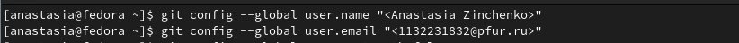{#fig:002 width=70%}

Настроила utf-8 в выводе сообщений git (рис.[-@fig:003])

{#fig:003 width=70%}

Задала имя начальной ветки (рис.[-@fig:004])

{#fig:004 width=70%}

Задала параметр autocrlf (рис.[-@fig:005])

{#fig:005 width=70%}

Задала параметр safecrlf (рис.[-@fig:006])

{#fig:006 width=70%}

     2. Создание SSH ключа
Сгенерировала приватный и открытый ключи (рис.[-@fig:007])

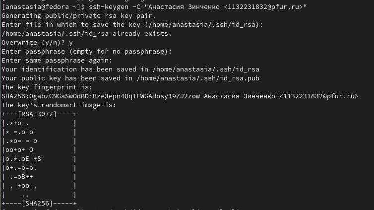{#fig:007 width=70%}

Загрузила сгенерированный открытый ключ (рис.[-@fig:008])

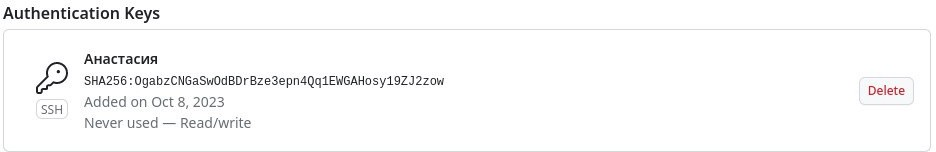{#fig:008 width=70%}

    3. Создание рабочего пространства и репозитория курса на основе шаблона
Создала каталог для предмета «Архитектура компьютера» (рис.[-@fig:009])

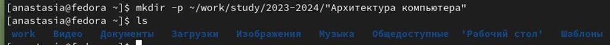{#fig:009 width=70%}

    4. Создание репозитория курса на основе шаблона
Создала репозиторий на основе шаблона через web- интерфейс githab (рис.[-@fig:010])

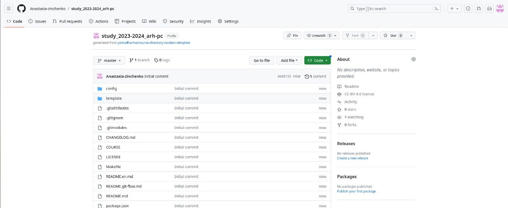{#fig:010 width=70%}

Открыла терминал и перешла в каталог курса (рис.[-@fig:011])

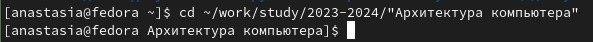{#fig:011 width=70%}

Клонирую созданный репозиторий (рис.[-@fig:012])

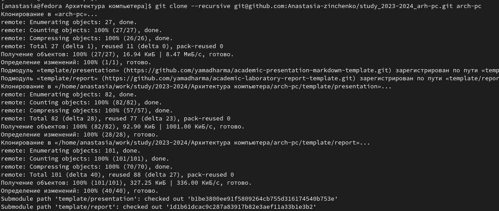{#fig:012 width=70%}

    5. Настройка каталога курса
Перешла в каталог курса и удалила лишние файлы (рис.[-@fig:013])

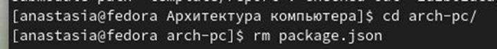{#fig:013 width=70%}

Создала необходимые каталоги (рис.[-@fig:014])

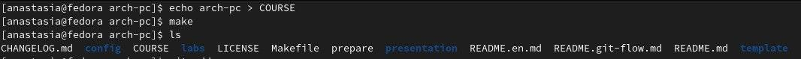{#fig:014 width=70%}

Отправила файлы на сервер (рис.[-@fig:015])

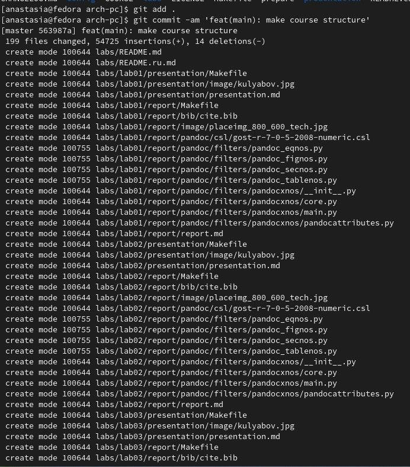{#fig:015 width=70%}

Проверила	правильность   создания	иерархии рабочего пространства в локальном репозитории и на странице github (рис.[-@fig:016])

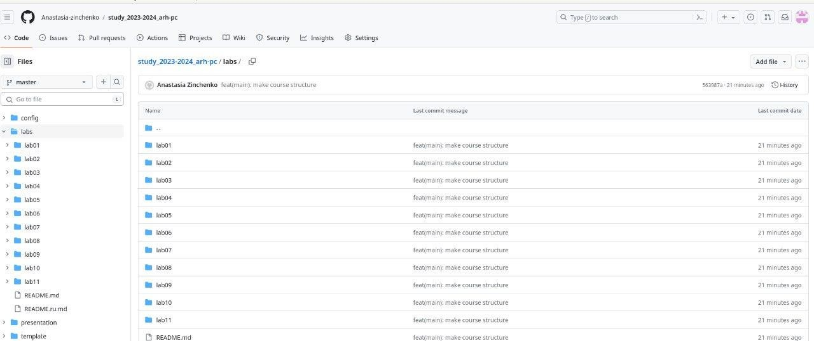{#fig:016 width=70%}

    6. Выполнение заданий для самостоятельной работы
Перехожу в директорию labs/lab02/report с помощью утилиты cd. Создаю в каталоге файл для отчёта второй лабораторной работы с помощью утилиты touch (рис.[-@fig:017])

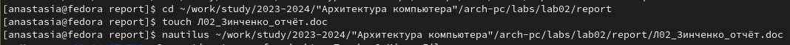{#fig:017 width=70%}

Проверяю скопировалась ли первая лабораторная работа (рис.[-@fig:018])

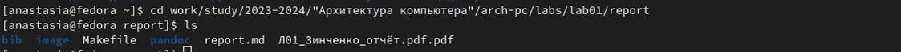{#fig:018 width=70%}

Перехожу в каталог arch-pc, чтобы отправить все добавленные файлы в репозиторий. Использую команды git add, git commit -m «Add existing files» и в конце git push (рис.[-@fig:019])

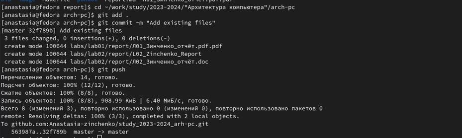{#fig:019 width=70%}

Проверила выполнение работы на сайте github (рис.[-@fig:020])

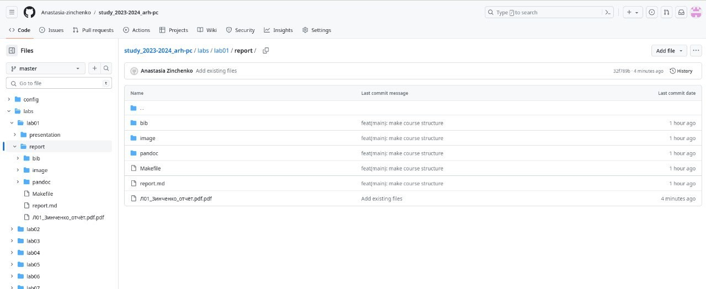{#fig:020 width=70%} 

# Выводы

В заключение хочу отметить, что я изучила идеологию и применение средств контроля версий. Также приобрела практические навыки по работе с системой github.

::: {#refs}
:::
