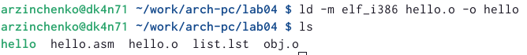

---
## Front matter
title: "Отчёт по лабораторной работе № 4"
subtitle: "Дисциплина: Архитектура компьютера"
author: "Зинченко Анастасия Романовна"

## Generic otions
lang: ru-RU
toc-title: "Содержание"

## Bibliography
bibliography: bib/cite.bib
csl: pandoc/csl/gost-r-7-0-5-2008-numeric.csl

## Pdf output format
toc: true # Table of contents
toc-depth: 2
lof: true # List of figures
lot: true # List of tables
fontsize: 12pt
linestretch: 1.5
papersize: a4
documentclass: scrreprt
## I18n polyglossia
polyglossia-lang:
  name: russian
  options:
	- spelling=modern
	- babelshorthands=true
polyglossia-otherlangs:
  name: english
## I18n babel
babel-lang: russian
babel-otherlangs: english
## Fonts
mainfont: PT Serif
romanfont: PT Serif
sansfont: PT Sans
monofont: PT Mono
mainfontoptions: Ligatures=TeX
romanfontoptions: Ligatures=TeX
sansfontoptions: Ligatures=TeX,Scale=MatchLowercase
monofontoptions: Scale=MatchLowercase,Scale=0.9
## Biblatex
biblatex: true
biblio-style: "gost-numeric"
biblatexoptions:
  - parentracker=true
  - backend=biber
  - hyperref=auto
  - language=auto
  - autolang=other*
  - citestyle=gost-numeric
## Pandoc-crossref LaTeX customization
figureTitle: "Рис."
tableTitle: "Таблица"
listingTitle: "Листинг"
lofTitle: "Список иллюстраций"
lotTitle: "Список таблиц"
lolTitle: "Листинги"
## Misc options
indent: true
header-includes:
  - \usepackage{indentfirst}
  - \usepackage{float} # keep figures where there are in the text
  - \floatplacement{figure}{H} # keep figures where there are in the text
---

# Цель работы

Освоить процедуру компиляции и сборки программ, написанных на ассемблере NASM

# Задание

1. Программа Hello world!
2. Транслятор NASM
3. Расширенный синтаксис командной строки NASM
4. Компоновщик LD
5. Запуск исполняемого файла 
6. Задания для самостоятельной работы

# Выполнение лабораторной работы

1. Создала каталог для работы с программами на языке ассемблера NASM. Перешла в него. Создала текстовый файл с именем hello.asm, открыла его с помощью gedit и ввела текст (рис. @fig:001), (рис. @fig:002)

{#fig:001 width=70%}, (image/002.png){#fig:002 width=70%}

2. Компилируем "Hello world" (рис. @fig:003)

{#fig:003 width=70%}

3. Скомпилировала hello.asm в obj.o и создала файл листинга, а также проверила создание файлов (рис. @fig:004), (рис. @fig:005), (рис. @fig:006)

{#fig:004 width=70%}, (image/005.png){#fig:005 width=70%},
(image/006.png){#fig:006 width=70%}

4. Передала объектный файл компоновщику и проверила, что исполняемый файл был создан (рис. @fig:007)

{#fig:007 width=70%}

  Посмотрела формат командной строки LD (рис. @fig:008), (рис. @fig:009)
  
{#fig:008 width=70%}, (image/009.png){#fig:009 width=70%}

5. Запустила на выполнение созданный исполняемый файл (рис. @fig:010)

{#fig:010 width=70%}

6. Создала копию hello.asm с именем lab4.asm (рис. @fig:011)

{#fig:011 width=70%}

7. С помощью gedit внесла изменения в текст программы в файле lab4.asm. Оттранслировала полученный текст программы. Выполнила компоновку объектного файла и запустила получившийся исполняемый файл (рис. @fig:016)

![запуск получившегося исполняемого файла]{#fig:016 width=70%}

8. Скопировала файлы в свой локальный репозиторий и загрузила всё на Github

# Выводы

Я освоила процедуру компиляции и сборки программы, написанных на ассемблере NASM

::: {#refs}
:::
