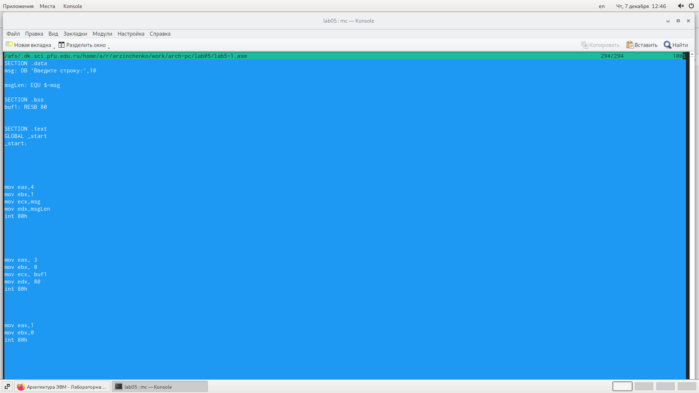

---
## Front matter
title: "Отчёт по лабораторной работе №5 "
subtitle: "Дисциплина: Архитектура компьютера"
author: "Зинченко Анастасия Романовна"

## Generic otions
lang: ru-RU
toc-title: "Содержание"

## Bibliography
bibliography: bib/cite.bib
csl: pandoc/csl/gost-r-7-0-5-2008-numeric.csl

## Pdf output format
toc: true # Table of contents
toc-depth: 2
lof: true # List of figures
lot: true # List of tables
fontsize: 12pt
linestretch: 1.5
papersize: a4
documentclass: scrreprt
## I18n polyglossia
polyglossia-lang:
  name: russian
  options:
	- spelling=modern
	- babelshorthands=true
polyglossia-otherlangs:
  name: english
## I18n babel
babel-lang: russian
babel-otherlangs: english
## Fonts
mainfont: PT Serif
romanfont: PT Serif
sansfont: PT Sans
monofont: PT Mono
mainfontoptions: Ligatures=TeX
romanfontoptions: Ligatures=TeX
sansfontoptions: Ligatures=TeX,Scale=MatchLowercase
monofontoptions: Scale=MatchLowercase,Scale=0.9
## Biblatex
biblatex: true
biblio-style: "gost-numeric"
biblatexoptions:
  - parentracker=true
  - backend=biber
  - hyperref=auto
  - language=auto
  - autolang=other*
  - citestyle=gost-numeric
## Pandoc-crossref LaTeX customization
figureTitle: "Рис."
tableTitle: "Таблица"
listingTitle: "Листинг"
lofTitle: "Список иллюстраций"
lotTitle: "Список таблиц"
lolTitle: "Листинги"
## Misc options
indent: true
header-includes:
  - \usepackage{indentfirst}
  - \usepackage{float} # keep figures where there are in the text
  - \floatplacement{figure}{H} # keep figures where there are in the text
---

# Цель работы

Приобрести практические навыки работы в Midnight Commander. Освоить инструкцию
языка ассемблера mov и int.

# Задание

1. Открыть Midnight Commander
2. Создать папку lab05, где будут храниться файлы лабораторной работы №5
3. Создать файл "lab5-1.asm", ввести текст программы. оттранслировать текст программы, выполнить компоновку объектного файла и запустить получившийся исполняемый файл
4. Пользуясь строкой ввода и командой touch создать файл lab5-1.asm
5. С помощью функциональной клавиши F4 открыть файл lab5-1.asm для редактирова-
ния во встроенном редакторе. 
6. Ввести текст программы из листинга 5.1, сохранить изме-
нения и закрыть файл.
7. С помощью функциональной клавиши F3 открыть файл lab5-1.asm для просмотра.
Убедиться, что файл содержит текст программы.
8. Оттранслировать текст программы lab5-1.asm в объектный файл. Выполнить компо-
новку объектного файла и запустить получившийся исполняемый файл. 
9. Скачайть файл in_out.asm со страницы курса в ТУИС.
10. С помощью функциональной клавиши F6 создайть копию файла lab5-1.asm с именем
lab5-2.asm. Выделить файл lab5-1.asm, нажать клавишу F6 , ввести имя файла
lab5-2.asm и нажать клавишу Enter
11. Исправить текст программы в файле lab5-2.asm с использование подпрограмм из
внешнего файла in_out.asm в соответствии с листингом 5.2. Создать исполняемый файл и проверить его работу.
12. В файле lab5-2.asm заменить подпрограмму sprintLF на sprint. Создайть исполняе-
мый файл и проверить его работу.
13. Задания для самостоятельной работы

# Выполнение лабораторной работы

Открыла Midnight Commande (рис.@fig:001).

{#fig:001 width=70%}

Пользуясь клавишами ↑ , ↓ и Enter переokf в каталог ~/work/arch-pc созданный
при выполнении лабораторной работы No4 (рис.@fig:002)

{#fig:002 width=70%}

С помощью функциональной клавиши F7 создала папку lab05 и перешла в созданный каталог (рис.@fig:003)

{#fig:003 width=70%}

Пользуясь строкой ввода и командой touch создала файл lab5-1.asm (рис.@fig:004)

{#fig:004 width=70%}

С помощью функциональной клавиши F4 открыла файл lab5-1.asm для редактирова-
ния во встроенном редакторе (рис.@fig:005)

{#fig:005 width=70%}

Ввела текст программы из листинга 5.1, сохранила изме-
нения и закрыла файл (рис.@fig:006)

{#fig:006 width=70%}

С помощью функциональной клавиши F3 открыла файл lab5-1.asm для просмотра.
Убедилась, что файл содержит текст программы (рис.@fig:007)

{#fig:007 width=70%}

Оттранслирровала текст программы lab5-1.asm в объектный файл. Выполнила компо-
новку объектного файла и запустила получившийся исполняемый файл. Программа вывела строку 'Введите строку:' и она ожидает ввода с клавиатуры. На запрос я ввела своё ФИО (рис.@fig:008)

{#fig:008 width=70%}

Скачала файл in_out.asm со страницы курса в ТУИС (рис.@fig:009)

{#fig:009 width=70%}

Подключаемый файл in_out.asm положила в тот же каталог, что и файл с программой, в которой он используется (рис.@fig:010)

{#fig:010 width=70%}

С помощью функциональной клавиши F6 создала копию файла lab5-1.asm с именем
lab5-2.asm. Выделила файл lab5-1.asm, нажала клавишу F6 , ввела имя файла
lab5-2.asm и нажала клавишу Enter (рис.@fig:011)

{#fig:011 width=70%}

Исправила текст программы в файле lab5-2.asm с использование подпрограмм из
внешнего файла in_out.asm в соответствии с листингом 5.2. Создала исполняемый файл и проверила его работу (рис.@fig:012), (рис.@fig:013)

{#fig:012 width=70%}

{#fig:013 width=70%}

В файле lab5-2.asm заменила подпрограмму sprintLF на sprint. Создала исполняе-
мый файл и проверила его работу (рис.@fig:014), (рис.@fig:015)

{#fig:014 width=70%}

{#fig:015 width=70%}

Разница в том, что в первом случае программа требовала, чтобы мы ввели текст на следующей строке, а во втором - сразу после знака двоеточия.

ЗАДАНИЯ ДЛЯ САМОСТОЯТЕЛЬНОЙ РАБОТЫ

Создала копию файла lab5-1.asm. Внесла изменения в программу, так чтобы она работала по следующему алгоритму:
• вывести приглашение типа “Введите строку:”;
• ввести строку с клавиатуры;
• вывести введённую строку на экран. (рис.@fig:016), (рис.@fig:017), (рис.@fig:018)

{#fig:016 width=70%}

{#fig:017 width=70%}

{#fig:018 width=70%}

Создала копию файла lab5-2.asm. Исправила текст программы с использование подпрограмм из внешнего файла in_out.asm, так чтобы она работала по следующему алгоритму:
• вывести приглашение типа “Введите строку:”;
• ввести строку с клавиатуры;
• вывести введённую строку на экран; (рис.@fig:019), (рис.@fig:020), (рис.@fig:021)

{#fig:019 width=70%}

{#fig:020 width=70%}

{#fig:021 width=70%}

# Выводы

Я приобрела практические навыки работы в Midnight Commander, а также освоила инструкцию
языка ассемблера mov и int.

::: {#refs}
:::
