---
## Front matter
title: "Отчёт по лабораторной работе №6 "
subtitle: "Дисциплина: Архитектура компьютера"
author: "Зинченко Анастасия Романовна"

## Generic otions
lang: ru-RU
toc-title: "Содержание"

## Bibliography
bibliography: bib/cite.bib
csl: pandoc/csl/gost-r-7-0-5-2008-numeric.csl

## Pdf output format
toc: true # Table of contents
toc-depth: 2
lof: true # List of figures
lot: true # List of tables
fontsize: 12pt
linestretch: 1.5
papersize: a4
documentclass: scrreprt
## I18n polyglossia
polyglossia-lang:
  name: russian
  options:
	- spelling=modern
	- babelshorthands=true
polyglossia-otherlangs:
  name: english
## I18n babel
babel-lang: russian
babel-otherlangs: english
## Fonts
mainfont: PT Serif
romanfont: PT Serif
sansfont: PT Sans
monofont: PT Mono
mainfontoptions: Ligatures=TeX
romanfontoptions: Ligatures=TeX
sansfontoptions: Ligatures=TeX,Scale=MatchLowercase
monofontoptions: Scale=MatchLowercase,Scale=0.9
## Biblatex
biblatex: true
biblio-style: "gost-numeric"
biblatexoptions:
  - parentracker=true
  - backend=biber
  - hyperref=auto
  - language=auto
  - autolang=other*
  - citestyle=gost-numeric
## Pandoc-crossref LaTeX customization
figureTitle: "Рис."
tableTitle: "Таблица"
listingTitle: "Листинг"
lofTitle: "Список иллюстраций"
lotTitle: "Список таблиц"
lolTitle: "Листинги"
## Misc options
indent: true
header-includes:
  - \usepackage{indentfirst}
  - \usepackage{float} # keep figures where there are in the text
  - \floatplacement{figure}{H} # keep figures where there are in the text
---

# Цель работы

Освоение арифметических инструкций языка ассемблера NASM

# Задание

1. Символьные и численные данные в NASM
2. Выполнение арифметических операций в NASM
3. Задание для самостоятельной работы

# Выполнение лабораторной работы

Создала каталог для программ лабораторной работы № 6, перещла в него и создала файл lab6-1.asm (рис.@fig:001).

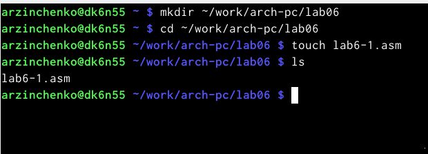{#fig:001 width=70%}

Из каталога "~/work/arch-pc/lab05" файл "in_out.asm" (рис.@fig:002)

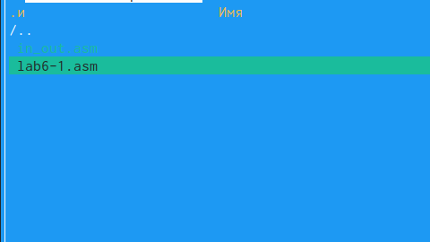{#fig:002 width=70%}

Ввела нужный текст программы (рис.@fig:003)

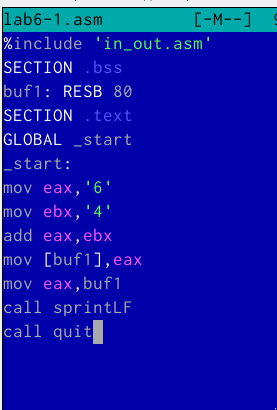{#fig:003 width=70%}

Создала исполняемый файл и запустила его (рис.@fig:004)

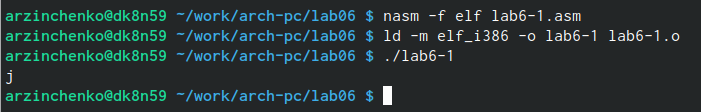{#fig:004 width=70%}

Изменила текст программы и вместо символов записала числа (рис.@fig:005)

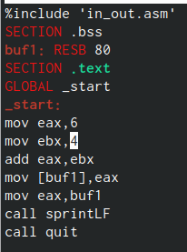{#fig:005 width=70%}

Создала исполняемый файл и запустила его (рис.@fig:006)

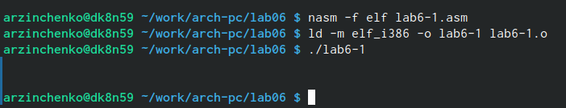{#fig:006 width=70%}

Код 10 соответствует символу переводу строки LF, который отображается при выводе на экран

Создала файл "lab6-2.asm" (рис.@fig:007)

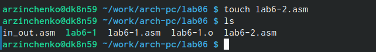{#fig:007 width=70%}

Ввела текст программы (рис.@fig:008)

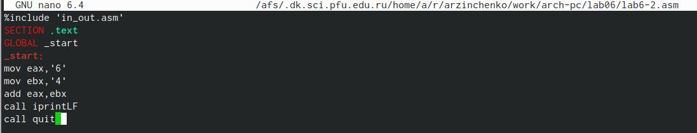{#fig:008 width=70%}

Создала исполняемый файл и запустила его (рис.@fig:009)

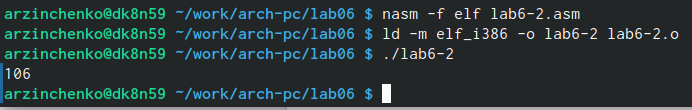{#fig:009 width=70%}

Поменяла символы на числа (рис.@fig:010)

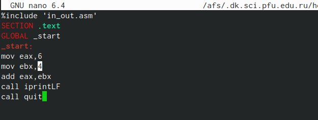{#fig:010 width=70%}

Создала исполняемый файл и запустила его (рис.@fig:011)

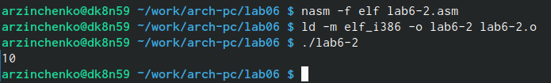{#fig:011 width=70%}

При исполнении будет получен результат 10

Заменила функцию iprintLF на iprint (рис.@fig:012)

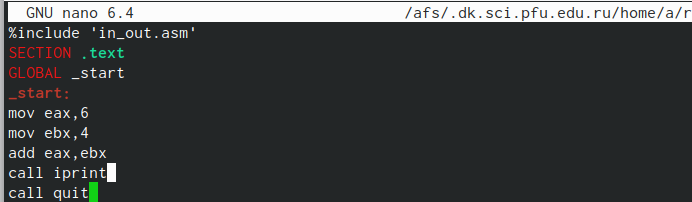{#fig:012 width=70%}

Создала исполняемый файл и запустила его (рис.@fig:013)

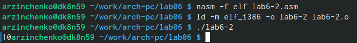{#fig:013 width=70%}

Функция iprint выводит строку без добавления символа LF, а iprintLF - с добавлением

Создала файл "lab6-3.asm" (рис.@fig:014)

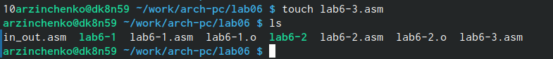{#fig:014 width=70%}

Ввела текст программы для вычисления f(x)=(5*2+3)/3 (рис.@fig:015)

{#fig:015 width=70%}

Создала исполняемый файл и запустила его (рис.@fig:016)

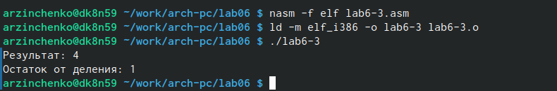{#fig:016 width=70%}

Изменила текст программы (рис.@fig:017)

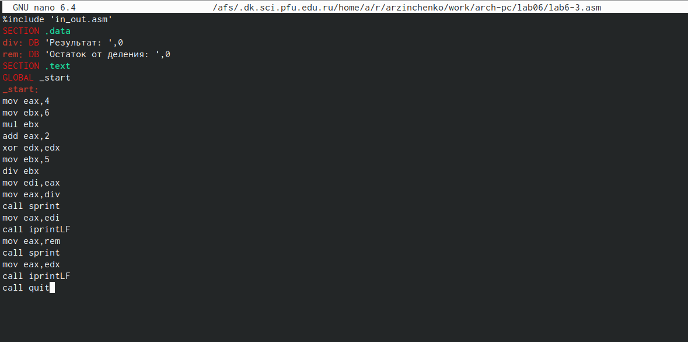{#fig:017 width=70%}

Создала исполняемый файл и запустила его 

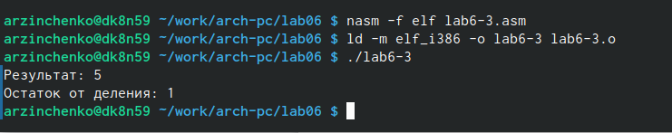{#fig:018 width=70%}

Создала файл "variant.asm" (рис.@fig:019)

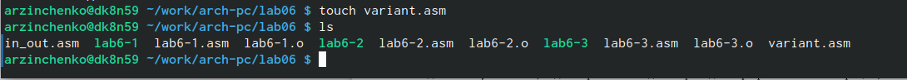{#fig:019 width=70%}

Ввела текст программы (рис.@fig:020)

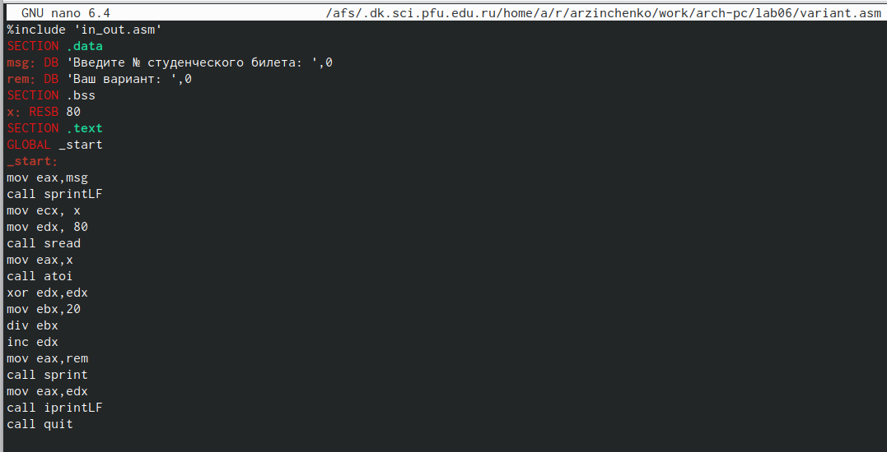{#fig:020 width=70%}

Создала исполняемый файл и запустила его (рис.@fig:021)

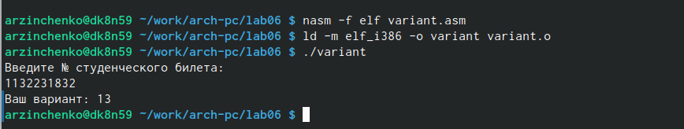{#fig:021 width=70%}

Ответы на вопросы:

1. mov eax,rem
   call sprint
   
2. mov ecx,x - запись адреса, пренесенная в ecx
   mov edx,80 - запись длины вводимого значения в edx
   call sread - вызов подпрограммы ввода сообщения
   
3. Вызывает функцию, которая преобразует ascii-код символа в целое число и записывает результат в регистр eax

4. mov eax,x
   call atoi
   xor edx,edx
   mov ebx,20
   div ebx
   inc edx
   
5. В регистр AH

6. Для увеличения значения регистра edx на 1

7. mov eax,edx
   call iprintLF
   
Задания для самостоятельной работы 

Создала файл "lab6-4.asm" (рис.@fig:022)

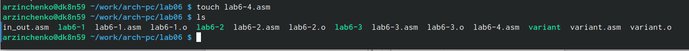{#fig:022 width=70%}

Ввела текст программы для вычисления выражения своего варианта ((8𝑥 + 6) ⋅ 10 ) (рис.@fig:023)

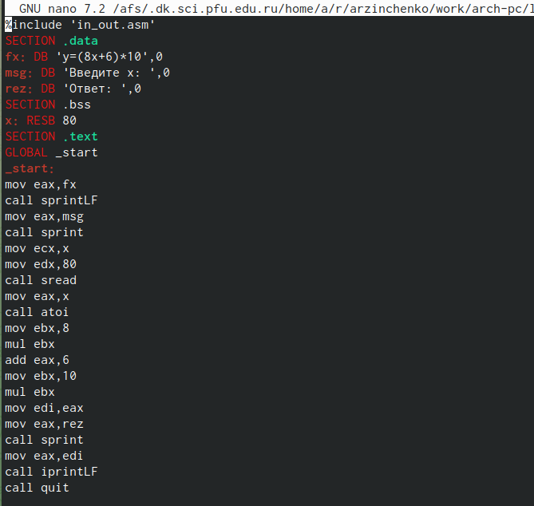{#fig:023 width=70%}

Создала исполняемый файл и запустила его (рис.@fig:024)

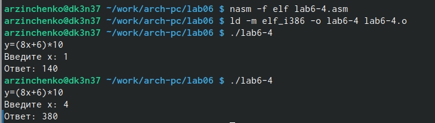{#fig:024 width=70%}

# Выводы

Я освоила арифметические инструкции языка ассемблера NASM

::: {#refs}
:::
